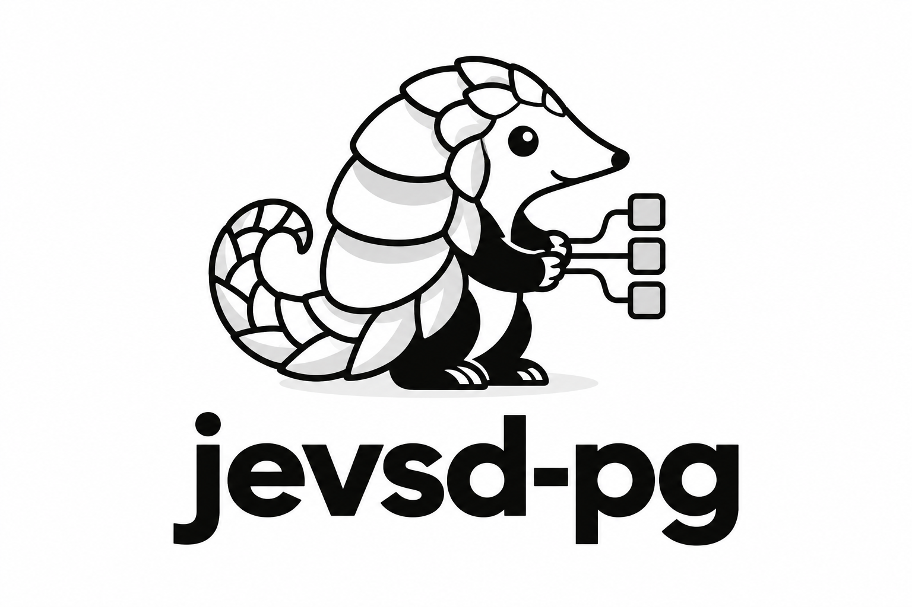

<h1 align="center">jevsd-pg</h1>

<p align="center">
  
</p>

<p align="center">
  <strong>A self-developing SQL database with JEV based semantic operators and natural language queries</strong>
</p>

Ask questions in plain language, inspect the SQL, and turn useful semantic decisions into reusable database features. jevsd-pg brings together 41 semantic operators, parallel JEV evaluation, cached evidence and optional LLM planning in a web workspace and HTTP API.

The operators combine JEV's native Noul, Choice and Score primitives with database and workflow logic. The default JEV service is provided by TypeSafe. You can also connect a compatible third-party endpoint or a local model adapter. PostgreSQL handles storage, joins and arithmetic.

[Installation](docs/INSTALLATION.md) · [User guide](docs/USER_GUIDE.md) · [简体中文](docs/zh/USER_GUIDE.md) · [Operator reference](docs/JEV_FUNCTION_REFERENCE.md)

## Why jevsd-pg

* Query data in English or Simplified Chinese. Inspect the SQL, correct its interpretation and rerun it from query history.
* Choose JEV planning or hybrid planning. In hybrid mode, JEV selects relevant context, an LLM proposes SQL, and JEV reviews the proposal.
* Query text by meaning alongside structured data. Save reviewed definitions as reusable features, such as whether a message requests action.
* Extract database entries from documents. Describe the rows and columns, then review typed values alongside their source text before importing.
* Preview inserts, updates and deletes before committing them.
* Batch independent semantic decisions and reuse compatible evidence. Apply the same operators to extraction, ranking, matching, verification and conditional workflows.
* Use TypeSafe, a compatible hosted endpoint or a local Python model adapter without changing operator calls.

The self-developing part is the semantic layer: definitions, evidence and corrections can be saved, reviewed, reused and refreshed as data changes. New concepts require approval before promotion.

## From question to SQL

Given a `deliveries` table with supplier names and quantities:

> For each supplier, show the total quantity delivered, largest total first.

The JEV planner generated:

```sql
SELECT
  SUM("r0"."quantity") AS "result_1",
  "r0"."supplier" AS "result_2"
FROM "deliveries" AS "r0"
GROUP BY
  "r0"."supplier"
ORDER BY
  SUM("r0"."quantity") DESC NULLS LAST
```

The result is Birch: 36, Aster: 30, Cedar: 8. The query groups repeated suppliers and ignores the unknown quantity when summing. SQL performs the calculation; JEV selects the meaning and structure.

See [verified examples](docs/NL2SQL_EXAMPLES.md) for filtering, averages and the runnable dataset. Preview a proposal, inspect its decisions, and approve it when it matches your intent.

## Getting started

You need Python 3.11 or newer, PostgreSQL and a configured JEV provider. TypeSafe requires an API key; a local provider can run without one. Python 3.13 and PostgreSQL 17 are the verified configuration. Hybrid mode also requires a configured LLM provider.

```bash
git clone https://github.com/Sheltercosmo/jevsd-pg.git
cd jevsd-pg
python -m venv .venv
```

Activate the environment with `.venv\Scripts\Activate.ps1` in PowerShell or `source .venv/bin/activate` in Bash, then install:

```bash
python -m pip install -r requirements.lock.txt
python -m pip install --no-deps -e .
```

Copy `.env.example` to `.env` and follow the [database setup](docs/INSTALLATION.md#postgresql) to create the application role and configure credentials. Then run:

```bash
python -m scripts.migrate_generic
python -m sdd.cli serve
```

Open the [English workspace](http://127.0.0.1:8000/ask/en) or [Simplified Chinese workspace](http://127.0.0.1:8000/ask/zh). Connect with your database access token and import data through Manage data.

## Query your data

Select a dataset and enter a question such as:

> For each supplier, show the total quantity delivered, largest total first.

Choose Preview plan to inspect the SQL. You can edit a planning decision, select an alternative interpretation or edit the SQL directly. Run the query when the proposal matches your intent. Data changes require a separate commit.

The same workflow is available through `POST /ask`:

```json
{
  "question": "For each supplier, show the total quantity delivered, largest total first.",
  "dataset_ids": ["deliveries"],
  "planner_mode": "hybrid",
  "execute": false
}
```

Use an ID or name from your catalog in `dataset_ids`. Set `planner_mode` to `jev` to plan without LLM generation. See the [query API guide](docs/NATURAL_LANGUAGE.md) and the local [API reference](http://127.0.0.1:8000/docs) for authentication and complete requests.

## Semantic operators

The API provides 41 operators and `WORKFLOW`. For example, send this request to `POST /jev/call` to test a proposition:

```json
{
  "operator": "JEV.NOUL",
  "arguments": {
    "state": "The shipment arrived on Tuesday.",
    "proposition": "The shipment has arrived."
  },
  "limits": {"max_judgments": 1, "max_requests": 1}
}
```

Results distinguish a known value, an unknown answer and work that was not evaluated. Independent judgments can run in parallel; compatible evidence can be reused.

Use the [operator guide](docs/JEV_OPERATORS.md) to select an operator and set budgets. The [function reference](docs/JEV_FUNCTION_REFERENCE.md) includes arguments, examples and result contracts for every operator.

## Simple-query performance

On the version 0.5.0 tutorial check, JEV-only planning matched GPT-5.6 Terra's SQL answer agreement: 11/11 proposals, with no LLM generation calls. Hybrid planning also matched all 11.

| Method | Matching SQL proposals | Median time | LLM calls |
| --- | ---: | ---: | ---: |
| JEV | 11/11 | 5.51 s | 0 |
| GPT-5.6 Terra | 11/11 | 4.94 s | 11 |
| JEV + GPT-5.6 Terra | 11/11 | 7.21 s | 11 |

The check contains eight basic objectives and three paired variations across two small synthetic datasets. All JEV and hybrid proposals were held for review and scored by executing their SQL in the evaluation. These results describe proposed answers, not automatic execution accuracy. Terra timing includes local CLI startup.

The [data, runner and results](examples/nl2sql/README.md) are included. See [performance and cost](docs/PERFORMANCE_AND_COST.md) for token usage, scoring and scope. Complex queries and new domains require their own evaluation.

Independent JEV decisions can run in parallel, and compatible evidence can be reused. [Local and hosted providers](docs/PROVIDERS.md) use the same operator interface, with cached judgments isolated by provider and revision.

## Documentation and contributions

See the [documentation index](docs/README.md) for text imports, semantic features and architecture. To report a problem, include a small synthetic dataset, the request and the expected result. Development setup and checks are in [CONTRIBUTING.md](CONTRIBUTING.md).

## License

[Apache 2.0](LICENSE). Third-party software retains its own licenses. See [NOTICE](NOTICE) and [dependencies](docs/DEPENDENCIES.md).
