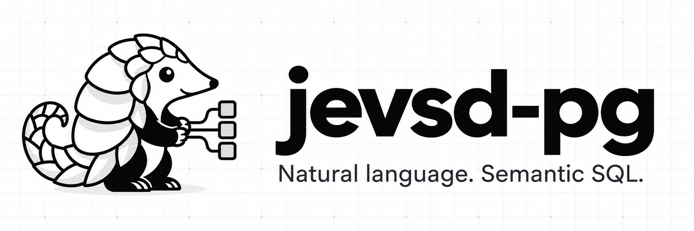

<p align="center">
  
</p>

<p align="center">
  <strong>A self-developing SQL database with JEV based semantic operators and natural language queries</strong>
</p>

<p align="center">
  <a href="https://github.com/Sheltercosmo/jevsd-pg/releases/tag/v0.6.0"></a>
  <a href="docs/NATIVE_DEPLOYMENT.md"></a>
  <a href="LICENSE"></a>
</p>

<p align="center">
  <a href="docs/INSTALLATION.md">Installation</a> ·
  <a href="docs/USER_GUIDE.md">User guide</a> ·
  <a href="docs/zh/USER_GUIDE.md">简体中文</a> ·
  <a href="docs/JEV_FUNCTION_REFERENCE.md">Function reference</a> ·
  <a href="docs/README.md">Documentation</a>
</p>

jevsd-pg adds 41 semantic operators, natural-language queries and reusable evidence to PostgreSQL. Its Rust extension evaluates independent questions in parallel and represents text as named answer probabilities. PostgreSQL performs the joins, calculations and transactions; JEV supplies typed semantic decisions.

Use the web workspace, HTTP API or PostgreSQL clients. Choose JEV planning or hybrid planning, where JEV selects context, an LLM proposes SQL, and JEV reviews it. Inspect the proposal, correct its interpretation and rerun it from history.

## What you can build

| Capability | How it works |
| --- | --- |
| Natural-language queries | Ask in English or Simplified Chinese, review the SQL and correct saved plans. |
| Semantic SQL | Filter and classify text alongside ordinary SQL. Native execution supports shared stages, derived relations and conditional branches. |
| Probability embeddings | Evaluate a fixed question basis, store each answer distribution and compare compatible records locally. |
| Reusable evidence | Save model observations separately from decision thresholds; reuse compatible evidence without another model call. |
| Existing PostgreSQL data | Attach authorized tables and views without importing their rows. |
| Document imports | Describe rows and columns, extract typed entries and review their source evidence before importing. |
| Reviewed database changes | Preview inserts, updates and deletes, then commit separately. |

The self-developing layer stores definitions, evidence and corrections as reusable database features. New definitions require review before promotion. The [provider interface](docs/PROVIDERS.md) supports TypeSafe, compatible hosted endpoints and local adapters.

## Choose an installation

| Path | Includes | Setup |
| --- | --- | --- |
| Release v0.6.0 | Workspace, HTTP API, Python semantic runtime and asynchronous `jev.*` SQL jobs | [Compose or existing PostgreSQL](docs/INSTALLATION.md) |
| Development source, 0.7.0.dev0 | The application plus Rust `jev_native.*`, source attachments and native SQL compilation | [Native Compose stack](docs/NATIVE_DEPLOYMENT.md) or [source build](native/README.md) |

The native extension is a development preview for PostgreSQL 17 on Linux. It can run directly from SQL without Python. Use the native Compose overlay to build and enable it; the default Compose stack uses Python. Native maintained features and semantic write review remain on the [roadmap](docs/IMPLEMENTATION_PLAN.md).

See the [changelog](CHANGELOG.md) for the features added since v0.6.0. Development builds report their application version through `jevsd-pg --version` and `/health`; the native extension has its own version.

To start the released application with Python 3.11+ and Docker Compose v2:

```bash
git clone --branch v0.6.0 https://github.com/Sheltercosmo/jevsd-pg.git
cd jevsd-pg
python deploy/configure.py
docker compose build
docker compose up -d --wait
```

Configuration creates local credentials and asks for a TypeSafe key. For another endpoint or local model, follow [provider setup](docs/PROVIDERS.md). Hybrid planning also needs an LLM provider.

Open the [English workspace](http://127.0.0.1:8000/ask/en) or [Simplified Chinese workspace](http://127.0.0.1:8000/ask/zh). Run `python deploy/configure.py --show-token` to retrieve your workspace token.

## From question to SQL

> For each supplier, show the total quantity delivered, largest total first.

This request produced the following query in the [runnable tutorial](examples/nl2sql/README.md):

```sql
SELECT
  SUM("r0"."quantity") AS "result_1",
  "r0"."supplier" AS "result_2"
FROM "deliveries" AS "r0"
GROUP BY "r0"."supplier"
ORDER BY SUM("r0"."quantity") DESC NULLS LAST
```

On the tutorial data, the result is Birch: 36, Aster: 30, Cedar: 8. SQL performs the calculation. See [query examples](docs/NL2SQL_EXAMPLES.md) for filtering and averages, or use `POST /ask`:

```json
{
  "question": "For each supplier, show the total quantity delivered, largest total first.",
  "dataset_ids": ["deliveries"],
  "planner_mode": "hybrid",
  "execute": false
}
```

Use a dataset ID or name from your catalog. Set `planner_mode` to `jev` for planning without LLM generation. [API usage](docs/NATURAL_LANGUAGE.md) covers authentication, review and execution.

## Native semantic SQL

After [installing the Rust extension](native/README.md), evaluate messages directly in PostgreSQL:

```sql
SELECT source->>'id' AS id, decisions->'action' AS decision
FROM jev_native.scan(
    'SELECT id, body FROM messages',
    '{"action":{"type":"noul","instructions":"The message requests further action.",
                "subject_column":"body"}}',
    '{"max_rows":500,"max_requests":500,"max_judgments":500,"concurrency":4}'
);
```

Put exact filters and required columns inside the source SELECT. Questions sharing context can share a request; independent contexts run concurrently within the budget. Use `scan_many` for independent populations or `execute_plan` for a [typed stage DAG](docs/NATIVE_PLANS.md). Dependencies wait for their inputs while unrelated work continues.

Results preserve `VALUE`, `UNKNOWN` and `NOT_EVALUATED` separately from operational status. A skipped branch does not become false. Exact calculations that require missing semantic decisions are held for review.

## Embeddings with named dimensions

Define questions such as “Does this message request action?” and “Is the issue resolved?” Then `jev_native.embed` returns every answer probability as a matrix and flattened vector. Noul questions have false/true dimensions; Choice and Score retain all declared answers.

Use `jev_native.answer_matrix` to project existing decisions and `jev_native.embedding_distance` to compare complete, compatible embeddings. Both run locally without model calls. Stored vectors retain their question basis and evaluator identity, so incompatible revisions cannot silently mix.

See the [embedding guide](docs/NATIVE_EMBEDDINGS.md) and [runnable SQL example](examples/operators/native_embedding.sql). Retrieval quality depends on the basis and provider; current execution tests do not establish a retrieval-quality or speed advantage.

## Documentation and contributions

The [documentation index](docs/README.md) covers operators, native plans, evidence, installation and examples. [Performance and cost](docs/PERFORMANCE_AND_COST.md) explains execution accounting and what to measure. The [roadmap](docs/IMPLEMENTATION_PLAN.md) records current native limitations.

To report a problem, include a small synthetic dataset, the request and the expected result. See [CONTRIBUTING.md](CONTRIBUTING.md) for development setup and checks.

## License

[Apache 2.0](LICENSE). Third-party software retains its own licenses. See [NOTICE](NOTICE) and [dependencies](docs/DEPENDENCIES.md).
